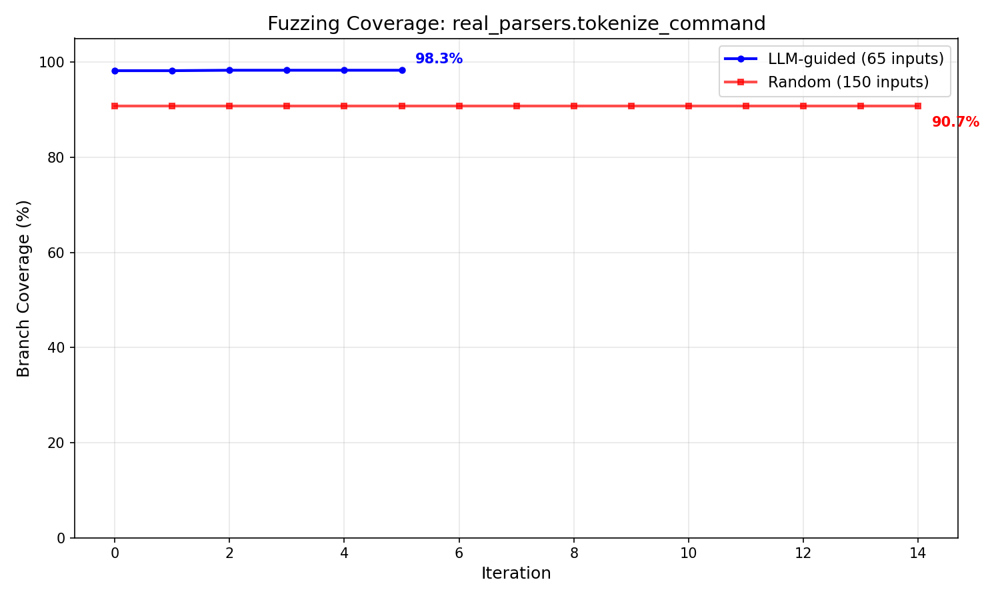

# llmfuzz

LLM-driven fuzzing agent that reads source code, reasons about branch coverage gaps, and generates targeted test inputs — not randomly, but by understanding what code paths haven't been hit yet.

## Why this exists

Traditional fuzzers (AFL, LibFuzzer) mutate inputs randomly or use genetic algorithms. They're fast but blind to code semantics. **llmfuzz** uses Claude to actually read the source code, understand its branch structure, and craft inputs designed to reach specific uncovered paths.

The result: higher branch coverage in fewer iterations, and crashes that random fuzzing can't find.

## How it works

```
┌─────────────────────────────────────────────────────────┐
│                    Agent Loop                           │
│                                                         │
│  1. Read source code + function signature               │
│  2. Send to Claude: "generate inputs to cover branches" │
│  3. Execute inputs in sandboxed subprocess              │
│  4. Collect coverage via coverage.py (line + branch)    │
│  5. Identify uncovered branches                         │
│  6. Send gaps back to Claude: "these paths are missed"  │
│  7. Claude generates smarter inputs                     │
│  8. Repeat until coverage plateaus                      │
└─────────────────────────────────────────────────────────┘
```

Each iteration, the agent adapts its strategy:
- **Broad** (iteration 0): diverse inputs to explore the function
- **Branch-targeted**: inputs crafted to hit specific uncovered conditions
- **Boundary**: off-by-one values, exact thresholds
- **Error path**: invalid types, None, empty collections
- **Type coercion**: float for int, list for str
- **Mutation**: tweak inputs that previously found new coverage

## Benchmark results

LLM-guided vs random fuzzing on a shell command tokenizer (112 lines, 26 branches):

| Metric | LLM-guided | Random |
|--------|-----------|--------|
| Branch coverage | **98.3%** | 90.7% |
| Crashes found | **4** | 0 |
| Inputs used | 70 | 150 |

The LLM wins by **7.6 percentage points** and finds crash-inducing inputs (unterminated quotes, dangling escapes) that random generation simply cannot construct by chance.



## Quick start

```bash
# Clone and install
git clone https://github.com/yourusername/llmfuzz.git
cd llmfuzz
python -m venv .venv && source .venv/bin/activate
pip install -e ".[dev]"

# Set your API key
echo "ANTHROPIC_API_KEY=sk-ant-your-key" > .env

# Fuzz a function
llmfuzz fuzz path/to/module.py -f function_name -n 10

# Run benchmark (LLM vs random)
llmfuzz benchmark path/to/module.py -f function_name -n 10
```

## CLI commands

```bash
# Fuzz a single function
llmfuzz fuzz module.py -f parse_data --max-iterations 15 --batch-size 10

# Discover all fuzzable functions in a file
llmfuzz discover module.py

# Compare LLM-guided vs random fuzzing
llmfuzz benchmark module.py -f parse_data -n 15

# View past sessions
llmfuzz sessions

# Inspect crashes from a session
llmfuzz crashes <session-id>

# Distributed fuzzing (requires Redis)
llmfuzz coordinator targets.py --redis-url redis://localhost:6379
llmfuzz worker --redis-url redis://localhost:6379  # run on N machines
```

## Distributed mode

For fuzzing many targets in parallel across a cluster:

```
┌──────────────┐     Redis Streams     ┌──────────────┐
│  Coordinator │ ──── tasks ────────→  │   Worker 1   │
│              │ ←─── results ───────  │              │
│  Discovers   │                       ├──────────────┤
│  targets,    │ ──── tasks ────────→  │   Worker 2   │
│  submits     │ ←─── results ───────  │              │
│  tasks,      │                       ├──────────────┤
│  monitors    │ ──── tasks ────────→  │   Worker N   │
│  progress    │ ←─── results ───────  │              │
└──────────────┘                       └──────────────┘
```

Workers pull tasks from a Redis Stream consumer group, run the full agent loop independently, and publish results back. The coordinator monitors progress and reassigns low-coverage targets with different strategies.

```bash
# Terminal 1: start coordinator
llmfuzz coordinator benchmarks/targets/real_parsers.py -n 10

# Terminal 2+: start workers (as many as you want)
llmfuzz worker
llmfuzz worker
```

Example output from a 2-worker run across 4 targets:

```
Submitted: real_parsers.parse_query_string (task 6d017be5)
Submitted: real_parsers.parse_email (task 601f63b2)
Submitted: real_parsers.tokenize_command (task 2c00f2c4)
Submitted: real_parsers.parse_content_type (task fd0744fa)

Completed: parse_email by worker-2 — 90.9% branch coverage, 1 crash, 161.9s
Completed: tokenize_command by worker-2 — 98.3% branch coverage, 4 crashes, 268.3s
Completed: parse_query_string by worker-1 — 95.8% branch coverage, 3 crashes, 473.0s
Completed: parse_content_type by worker-2 — 96.2% branch coverage, 0 crashes, 100.6s
```

## Architecture

```
src/llmfuzz/
├── agent/                # Core agent loop
│   ├── loop.py           # Analyze → generate → execute → reflect cycle
│   ├── memory.py         # Tracks what worked/didn't across iterations
│   ├── strategy.py       # Adaptive strategy selection
│   └── prompts.py        # Prompt engineering for coverage-guided generation
│
├── execution/            # Sandboxed test execution
│   ├── sandbox.py        # Subprocess isolation with timeout
│   ├── runner.py         # Batch execution orchestrator
│   └── harness_template.py
│
├── coverage/             # Coverage tracking & analysis
│   ├── collector.py      # Wraps coverage.py for incremental tracking
│   ├── analyzer.py       # Identifies uncovered branches for the LLM
│   └── visualizer.py     # Matplotlib benchmark charts
│
├── analysis/             # Source analysis & benchmarking
│   ├── source.py         # AST-based target discovery
│   └── benchmark.py      # LLM vs random comparison runner
│
├── distributed/          # Horizontal scaling via Redis
│   ├── coordinator.py    # Task submission & monitoring
│   ├── worker.py         # Stateless fuzzing worker
│   └── streams.py        # Redis Streams abstraction
│
├── storage/              # Persistence
│   ├── db.py             # SQLite connection management
│   ├── repository.py     # Async data access layer
│   └── schemas.sql       # Database schema
│
├── models/               # Pydantic data models
│   ├── target.py         # FuzzTarget, FunctionSignature
│   ├── session.py        # FuzzSession
│   ├── execution.py      # ExecutionResult, CrashReport
│   ├── input.py          # TestInput
│   ├── coverage.py       # CoverageSnapshot
│   └── task.py           # FuzzTask, TaskResult (distributed)
│
├── random_fuzzer/        # Baseline for comparison
│   └── baseline.py       # Type-aware random input generation
│
└── cli.py                # Typer CLI entry point
```

## How the agent reasons

On iteration 0, Claude sees the raw source code and generates diverse inputs. On subsequent iterations, it receives specific coverage gaps:

```
Current coverage: 92.3% branches (24/26)
Uncovered branches:
  Line 128: char in ('"', '\\', '$', '`', '\n') — FALSE branch
    Context: Inside double-quote escape handling
  Line 207: escape_next is True at end of string
    Context: Trailing backslash with no following character

Generate inputs that will reach these specific uncovered paths.
```

Claude then crafts targeted inputs like `'echo "test \\"nested\\" quote"'` or `'trailing\\'` — inputs that require understanding the tokenizer's state machine to construct.

## Tech stack

- **Claude** (via Anthropic SDK) — code reasoning and input generation
- **coverage.py** — branch-level coverage instrumentation
- **Redis Streams** — distributed task queue with consumer groups
- **SQLite** — session and crash persistence
- **Typer + Rich** — CLI with live progress output
- **Pydantic** — type-safe data models
- **Matplotlib** — benchmark visualization

## License

MIT
